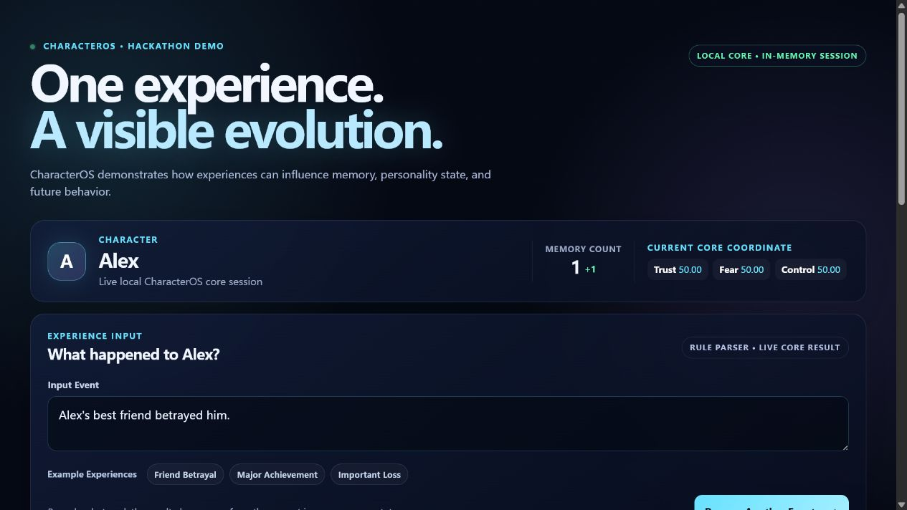

# CharacterOS

> **Simulate people, not stories.**

CharacterOS is a deterministic, single-character psychological simulation engine. An experience is parsed into a calibrated impact, accumulated through memory and belief, and then projected into needs, desires, and a decision surface. It is not a chatbot, does not diagnose people, and does not let an LLM write character state.

This repository is prepared for a hackathon demo: the fastest path is the isolated local experience in [`demo/`](demo/README.md).



## Hackathon quick start

Prerequisites: Node.js 22 and npm.

```powershell
npm ci
npm run demo:hackathon
```

Open [http://127.0.0.1:4174](http://127.0.0.1:4174). No API key, database, login, or persistent character data is required. Press `Ctrl+C` to stop the demo.

The demo starts Alex from a fresh in-memory state, lets you submit an experience, then makes the causal chain visible:

```text
Experience
-> deterministic parser
-> impact particle
-> memory and impact cluster
-> bounded personality-state transition
-> derived decision view
```

The UI is a presentation surface only. It invokes the real existing Core modules but never calls persistent repository or Next.js write routes. See the [demo run-of-show](demo/README.md#video-run-of-show-about-2-minutes) for a two-minute recording plan.

## What makes it different

- **Causal instead of prompt-only:** experiences flow through structured, inspectable state transitions.
- **Deterministic first:** identical input, logical event time, and engine version are designed to replay identically.
- **Bounded personality change:** a single event cannot directly overwrite long-term personality.
- **Safe product boundary:** UI and LLM adapters observe or propose language; the Core owns accepted state transitions.
- **Single-character focus:** no relationship graph, world simulation, or autonomous agent loop is presented as implemented.

## Repository map

| Path | Purpose |
| --- | --- |
| [`demo/`](demo/README.md) | Standalone in-memory hackathon demo and recording guide |
| [`src/core/`](src/core) | Headless deterministic simulation kernel |
| [`src/services/`](src/services) | Explicit application and persistence boundaries |
| [`src/app/`](src/app) | Next.js API and read-only product surfaces |
| [`tests/`](tests) | Unit, regression, replay, audit, and boundary tests |
| [`docs/INDEX.md`](docs/INDEX.md) | Curated architecture, roadmap, and release documentation |
| [`docs/archive/README_history.md`](docs/archive/README_history.md) | Preserved historical root README and version log |

## Development and verification

```powershell
npm run build       # TypeScript type check
npm test            # Vitest suite
npm run next:build  # Next.js production build
npm run rc:verify   # Release-quality gates
```

运行 npm test 全量单元与审计测试。当前封存基线为 **V10.78 RC** 与 V11 RC：Core Reality Gate **PASS**、Unified Quality Gate **PASS**、active warnings 为 0。

The V10.78 RC sealed baseline records **2163 tests** across **170 files**.

当前范围保持**单角色内核**：不做多角色，**V20 未开始**。

The active engineering direction is [Core Calibration & Durability](docs/core_calibration_durability_roadmap.md): durable event/state storage and replay come before new visual features. The current physics core, Explorer, MindSpace, Agent SDK, and LLM boundary all have deliberately separate responsibilities; see the [latest development flow](docs/latest_development_flow.md).

## Safety and scope

- CharacterOS is a simulation, not a psychological or medical diagnosis.
- The Core remains headless: it does not depend on React, Next.js, Three.js, provider SDKs, or routes.
- LLM/provider output has no mutation or writeback authority.
- Durable writes require explicit service boundaries; the hackathon demo performs no durable write.
- Secrets belong in `.env`; never commit API keys.

## Further reading

- [Hackathon demo guide](demo/README.md)
- [Documentation index](docs/INDEX.md)
- [Contributing and quality gates](CONTRIBUTING.md)
- [Change log](CHANGELOG.md)
